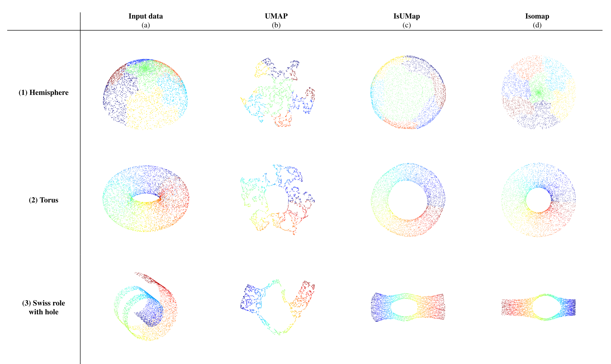

# IsUMap

IsUMap is a dimension reduction and data visualization tool, that can be viewed as a combination of the manifold learning algorithms [UMAP](https://github.com/lmcinnes/umap) and [Isomap](https://scikit-learn.org/stable/modules/generated/sklearn.manifold.Isomap.html).

The theoretical basis of IsUMap is explained in the following publications:
  - [Fuzzy simplicial sets and their application to geometric data analysis](https://arxiv.org/abs/2406.11154)
  - [IsUMap: Manifold Learning and Data Visualization leveraging Vietoris-Rips filtrations](https://arxiv.org/abs/2407.17835)

Please cite them when using IsUMap.

Note that an appendix that contains additional theoretical aspects and numerical experiments is given in the `Appendix` folder.

# Usage

Right now, we do not yet provide IsUMap as a package. 
But since it is rather lightweight (except, perhaps, for the pytorch dependency), you can use it simply by cloning the repo, and installing the dependencies in `environment.yml`.

For example, assuming you want to install with `conda` to a new environment, you can run:
```
git clone git@github.com:LUK4S-B/IsUMap.git && cd IsUMap
conda env create -f environment.yml
conda activate isumap
```

After that, you should be able to run `python minimal_example.py`. Other examples are described in the next section below.

# Examples

In `minimal_example.py`, one can choose one of a series of example datasets, simply by uncommenting one of the following lines:

```python
data, labels = createNonUniformHemisphere(N)
# data, labels = createSwissRoll(N,hole=True,seed=0)
# data, labels = createFourGaussians(8.2,N)
# data, labels = createMoons(numberOfPoints,noise=0.1,seed=42)
# data, labels = createTorus(N,seed=0)
# data, labels = createMammoth(N,k=30,seed=42)

# data, labels = load_MNIST(N)
# data, labels = createBreastCancerDataset()
# data, labels = load_FashionMNIST(N)
```

The default example is the non-uniform hemisphere, that is supposed to show that IsUMap can successfully uniformize the data distribution. 

Below we provide a figure that compares some results.



One can see that IsUMap excels for manifolds with lower dimension because it distorts distances less than UMAP, while being able to uniformize the data distribution better than Isomap. However, the decreased amount of distortion also results in lower clustering capability for high-dimensional datasets.

# Arguments and parameters

IsUMap takes the following input arguments and parameters with the following meaning:
```python
finalEmbedding, clusterLabels = isumap(
  data, 
  # the dataset in form of an NxM numpy matrix

  k,  
  # a positive integer that denotes the number of
  # nearest neighbours of each datapoint (typically 5-50)

  d,  
  # a positive integer that denotes the
  # embedding dimension (typically 2 or 3)

  labels=labels,  
  # an NxL numpy matrix that denotes the
  # labels, that serve as colors 
  # in the visualization plots

  normalize = True, 
  # whether the data distribution should be normalized

  distBeyondNN = True,  
  # whether the distance to the nearest neighbour
  #  should be subtracted (to counter-act 
  # the curse of dimensionality to some extent)
  
  metricMDS = True, 
  # whether metric multidimensional scaling (mMDS)
  #  should be performed (via stochastic gradient descent)

  initialization = "cMDS", 
  # the default dimension reduction technique 
  # that initializes the stochastic gradient descent
  #  procedure of metric MDS. 
  # The default option is classical MDS "cMDS". 
  # Alternative choices are "spectral" and "random". 
  # If metricMDS = False, then the "initialization" 
  # is used as the final embedding.

  verbose = True, 
  # whether to output descriptions 
  # of what is being computed

  dataIsDistMatrix = False, 
  # if this is set to True, then the 'data'-matrix 
  # is directly supposed to be in the format of an
  #  NxN symmetric distance matrix and local 
  # neighbourhoods and geodesic distances are then
  #  computed based on this matrix. Please only set 
  # this to True if your 'data' has the right format.

  dataIsGeodesicDistMatrix = False, 
  # if this is set to True, then no geodesic distance
  # matrix is computed from the data but the 
  # 'data'-matrix is directly used for dimension 
  # reduction. Please only set this to True if your
  # 'data' has the right format, i.e. is an NxN 
  # symmetric distance matrix and you do not want
  # to compute geodesic distances anymore.

  saveDistMatrix = False, 
  # if this is set to True, then the geodesic
  # distance matrix, that is computed with the
  # Dijkstra algorithm before the dimension 
  # reduction, is stored. 
  # Since the Dijkstra computation takes some 
  # time, this can be quite useful in combination 
  # with the 'dataIsGeodesicDistMatrix' parameter 
  # above: In the first run, you can set 
  # 'dataIsGeodesicDistMatrix = False' and 
  # 'saveDistMatrix = True' to store the geodesic 
  # distance matrix and in subsequent runs, you 
  # can load the geodesic distance matrix from 
  # the file it was stored in, and set 
  # 'dataIsGeodesicDistMatrix = True' 
  # (and 'saveDistMatrix = False') in order 
  # to avoid recomputing it.

  # The rest of the parameters only have an effect 
  # if 'metricMDS = True'. In that case, they 
  # influence the behaviour of the stochastic 
  # gradient descent (SGD) procedure that is 
  # used for metric multidimensional scaling.
  sgd_n_epochs = 1500, 
  sgd_lr=1e-2, 
  sgd_batch_size = None,
  sgd_max_epochs_no_improvement = 75, 
  sgd_loss = 'MSE', 
  sgd_saveplots_of_initializations=True, 
  sgd_saveloss=True
)
```
Please note that, if `normalize = False`, and  `distBeyondNN = False` and `metricMDS = False`, then our algorithm produces as special case an efficient implementation of Isomap.

In particular, we parallelized the implementation of the Dijkstra algorithm for computing geodesic distances, which results in better runtimes than the original implementation.

The `clusterLabels` that are being returned in addition to the embedding only label disconnected components of the geodesic distance matrix (and hence are only suitable for a very rough clustering).
