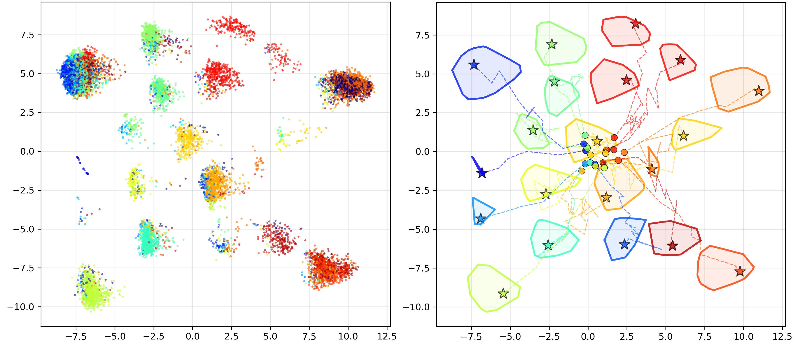

# IsUMap

IsUMap is a dimension reduction and data visualization tool, that can be viewed as a combination of the manifold learning algorithms [UMAP](https://github.com/lmcinnes/umap) and [Isomap](https://scikit-learn.org/stable/modules/generated/sklearn.manifold.Isomap.html).

The theoretical basis of IsUMap is explained in the following publications:
  - [Fuzzy simplicial sets and their application to geometric data analysis](https://link.springer.com/article/10.1007/s10485-025-09827-x)
  - [IsUMap: Manifold Learning and Data Visualization Leveraging Vietoris-Rips Filtrations](https://ojs.aaai.org/index.php/AAAI/article/view/33946)

Please cite them when using IsUMap.

Note that an appendix that contains additional theoretical aspects and numerical experiments is given in the `Appendix` folder.

# Usage

Right now, we do not yet provide IsUMap as a package. 
But since it is rather lightweight (except, perhaps, for the pytorch dependency), you can use it simply by cloning the repo, and installing the dependencies in `environment.yml`.

For example, assuming you want to install with `conda` to a new environment, you can run:
```
git clone git@github.com:LUK4S-B/IsUMap.git && cd IsUMap
conda env create -f environment.yml
conda activate isumap
```

After that, you should be able to run `python minimal_example.py`. Other examples are described in the next section below.

# Examples

In `minimal_example.py`, one can choose one of a series of example datasets, simply by uncommenting one of the following lines:

```python
data, labels = createNonUniformHemisphere(N)
# data, labels = createSwissRoll(N,hole=True,seed=0)
# data, labels = createFourGaussians(8.2,N)
# data, labels = createMoons(numberOfPoints,noise=0.1,seed=42)
# data, labels = createTorus(N,seed=0)
# data, labels = createMammoth(N,k=30,seed=42)
```

The default example is the non-uniform hemisphere, that is supposed to show that IsUMap can successfully uniformize the data distribution. 

Below we provide a figure that compares some results for low-dimensional manifolds.


One can see that IsUMap excels for manifolds with lower dimension because it distorts distances less than UMAP, while being able to uniformize the data distribution better than Isomap. 

For high-dimensional datasets, we implemented a cluster separation algorithm that uses information of a clustering algorithm to pull the convex hulls of the clusters in the embedding apart via stochastic gradient descent (SGD). Here is an example for the 20-newsgroups document embedding dataset:



We can see on the left side that our algorithm is capable of separating the newsgroups quite well into distinct clusters. On the right side of the figure, the colored dots in the center mark the medoids of the clusters and their distances (computed in the original metric space and then embedded via metric multidimensional scaling). The cluster separation optimization procedures then pulls the clusters apart via SGD, while making sure that the intercluster distances are monotonic functions of the distances in the original space. The colored stars mark the final positions of the medoids and one can see the paths they took during the cluster separation procedure on the right side of the figure. In this way, the user can obtain information about the clusters and about the distortion that the visualization of these clusters required in comparison to a local optimum of a metric embedding.

See `Simulations/Simulations for article - Fuzzy simplicial sets and their application to geometric data analysis/` for further examples.
